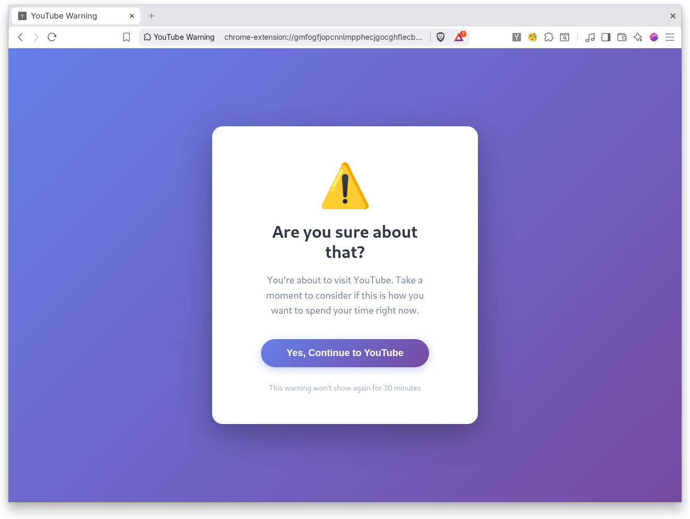

# YouTube Warning Chrome Extension

A Chrome extension that shows a warning page before you visit YouTube, helping you be more mindful about your time.

## Features

- Intercepts all attempts to visit YouTube
- Shows a friendly warning page asking "Are you sure about that?"
- 30-minute timeout: Once you proceed to YouTube, the warning won't show again for 30 minutes
- After 30 minutes, the warning will reappear on your next YouTube visit

## Installation

1. Open Chrome and navigate to `chrome://extensions/`
2. Enable "Developer mode" by toggling the switch in the top right corner
3. Click "Load unpacked"
4. Select the folder containing these extension files
5. The extension is now installed and active!

## How It Works

1. When you try to visit any YouTube URL (youtube.com), the extension intercepts the navigation
2. If more than 30 minutes have passed since you last visited, you'll see the warning page
3. Click "Yes, Continue to YouTube" to proceed
4. The extension will remember this and won't show the warning again for 30 minutes

## Files

- `manifest.json` - Extension configuration
- `background.js` - Background service worker that handles navigation interception
- `warning.html` - The warning page UI
- `warning.js` - JavaScript for the warning page
- `README.md` - This file

## Customization

You can customize:
- The timeout duration by changing `30 * 60 * 1000` in `background.js` (currently 30 minutes in milliseconds)
- The warning message by editing `warning.html`
- The styling by modifying the CSS in `warning.html`

## Permissions

This extension requires:
- `storage` - To remember when you last allowed YouTube access
- `webNavigation` - To intercept navigation to YouTube
- `host_permissions` for `*.youtube.com` - To detect YouTube visits
